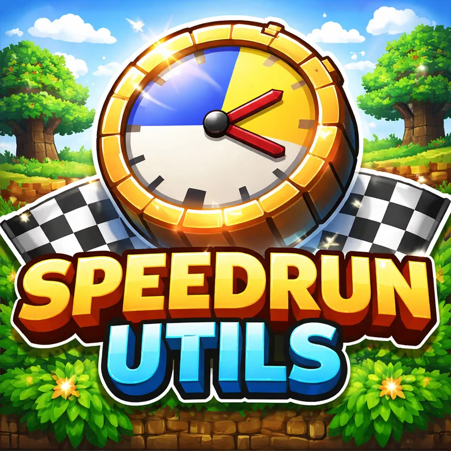

# SpeedrunUtils

<!-- markdownlint-disable MD033 -- img tag used to specify width -->


A Minecraft Fabric mod for managing speedruns with built-in timer, blindness mechanics, and run tracking.

> **Note:** This mod is still in development and is (mostly) generated by AI.

> **Note:** This mod is meant to be installed server-only, but can be installed on a client (untested).

<!--
clear; dockerr kill minecraft; rm -rf /services/volumes/minecraft/world; sudo truncate -s 0 "/var/lib/docker/containers/$(docker inspect -f '{{.Id}}' minecraft)/local-logs/container.log"; dockerr up -d minecraft; docker logs -f minecraft
 -->

## Preview


## Features

### Commands

#### `/startrun`

- **Permission Level:** 0 (all players)
- **Description:** Starts a speedrun with a 3-second countdown
- **Behavior:**
  - Can only be run once per speedrun (before the run starts)
  - Displays a 3-second countdown to all players
  - Removes blindness effect from all players
  - Starts the scoreboard timer
  - Plays sound effects for countdown and start

#### `/pauserun`

- **Permission Level:** 0 (all players)
- **Description:** Pauses or resumes the current speedrun
- **Behavior:**
  - When pausing:
    - Stops the timer
    - Applies blindness to all players
  - When resuming:
    - Continues the timer
    - Removes blindness from all players

#### `/stoprun`

- **Permission Level:** 0 (all players)
- **Description:** Stops the current speedrun and clears the timer
- **Behavior:**
  - Stops the run (if one is active)
  - Clears the timer
  - Removes blindness from all players (in case the run was paused)
  - Broadcasts: “Run stopped. Timer cleared.”

#### `/newrun`

- **Permission Level:** 0 (all players)
- **Description:** Saves the current run and prepares for a new speedrun
- **Behavior:**
  - Stops the run (if one is active)
  - Saves the current run data to `speedruns.txt` in the server root
  - Records: timestamp, player names, time, and completion status
  - Resets the run state
  - Applies blindness to all players
  - Notifies players about server restart for world regeneration

## Gameplay Flow

1. **Server Start:** All players join with blindness effect applied
2. **Run Start:** Any player runs `/startrun` to begin the countdown
3. **Speedrun:** Players complete the game while the timer runs
4. **Completion:** Timer automatically stops when a player exits through the End portal after defeating the Ender Dragon

## Automatic Features

- **Blindness on Join:** Players automatically receive blindness when joining before a run starts
- **Timer Display:** Action bar shows elapsed time with milliseconds at the bottom of the screen, updating 20 times per second (each tick)
- **Splits:** Automatically records key milestones, broadcasts them to chat, and shows them on a sidebar scoreboard during the run
- **Auto-Complete Detection:** Run automatically completes when the Ender Dragon is defeated & a player teleports
  through the End portal back to the Overworld (after the credits screen)
- **Run Tracking:** All runs are logged to `speedruns.txt` with:
  - Date and time
  - Player names
  - Final time (formatted as HH:MM:SS or MM:SS)
  - Completion status
  - Splits (when recorded)

## Splits

Splits are recorded automatically while a run is **RUNNING**. Each split is:

- Broadcast to all players as a chat message
- Added to a sidebar scoreboard titled **Speedrun Splits**
- Reflected next to the timer as the **latest split** in the action bar
- Saved under a **Splits:** section in `speedruns.txt` when the run is saved

### Current split list

- **First Iron:** Get the "Acquire Hardware" advancement (smelt/obtain an iron ingot)
- **Entered Nether:** First time a player enters the Nether during the run
- **Entered Nether Fortress:** Get the "A Terrible Fortress" advancement (enter a nether fortress)
- **First Blaze Kill:** First blaze killed by a player during the run
- **Blaze Rods Done:** Server-wide total blaze rods across all online players reaches **7**
- **Ender Pearls Done:** Server-wide total ender pearls across all online players reaches **14**
- **First Ender Eye:** First time an Eye of Ender is crafted
- **Stronghold Found:** Get the "Eye Spy" advancement (enter a stronghold)
- **Entered End:** First time a player enters the End during the run

## Installation

1. Install Fabric Loader
2. Install Fabric API
3. Place the mod JAR in your `mods` folder

## Building

The built JAR will be in `build/libs/`

### on Windows

```powershell
.\gradlew.bat build
```

### on Linux

```bash
./gradlew build
```

## Requirements

- Minecraft 1.21.11
- Fabric Loader >= 0.18.3
- Fabric API
- Java 21+
